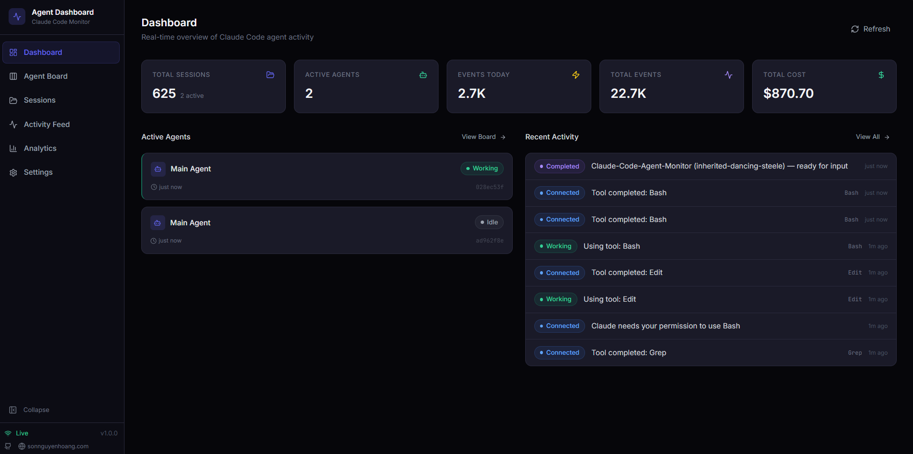
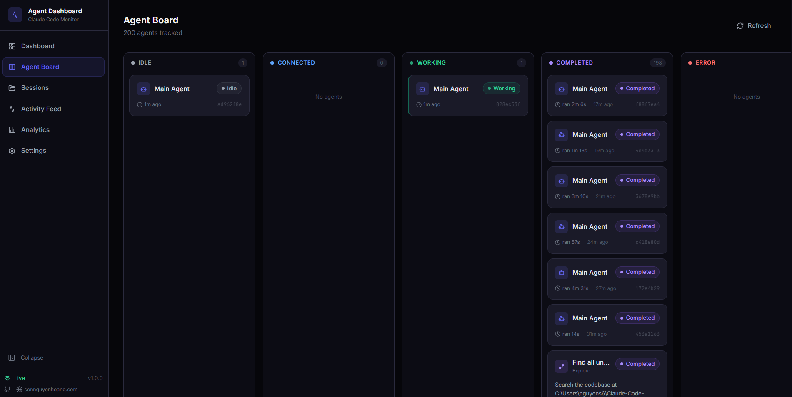
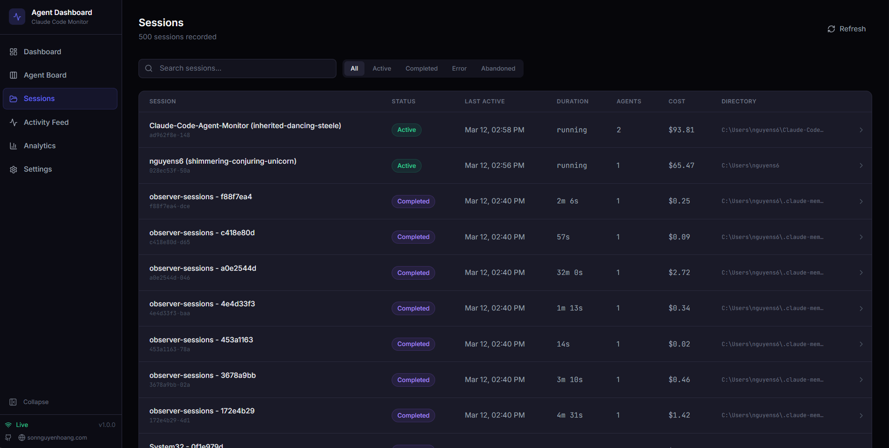
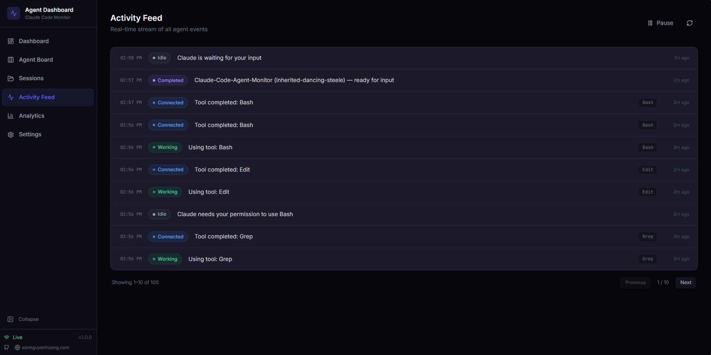
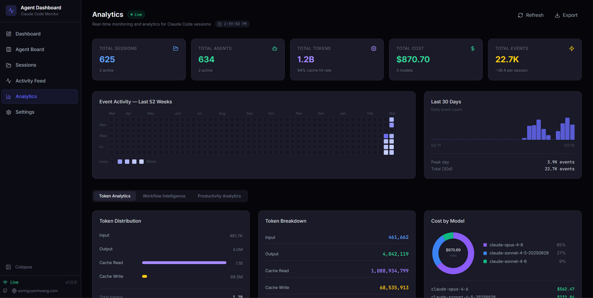
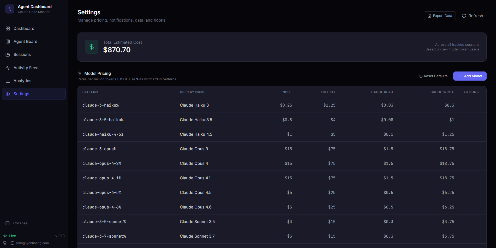

# Installation

## Requirements

| Requirement | Version | Notes |
|---|---|---|
| Node.js | 18+ | Required for server and client |
| npm | 9+ | Comes with Node.js |
| Claude Code | 2.x+ | Required for hook integration |
| Python | 3.6+ | Optional — statusline utility only |
| Git | Any | For cloning the repository |

---

## Step 1 — Clone the repository

```bash
git clone https://github.com/hoangsonww/Claude-Code-Agent-Monitor.git
cd Claude-Code-Agent-Monitor
```

---

## Step 2 — Install dependencies

```bash
npm run setup
```

This installs all server and client dependencies in a single command. It is equivalent to:

```bash
npm install
cd client && npm install
```

---

## Step 3 — Start the dashboard

```bash
npm run dev
```

This starts two processes concurrently:

| Process | URL | Description |
|---|---|---|
| Express server | http://localhost:4820 | API, WebSocket, SQLite |
| Vite dev server | http://localhost:5173 | React frontend with HMR |

Open **http://localhost:5173** in your browser.

> [!TIP]
> When you run the dashboard directly on the host with `npm run dev` or `npm start`, the server automatically writes the Claude Code hook configuration to `~/.claude/settings.json`. If you run the dashboard in Docker or Podman, install hooks from the host with `npm run install-hooks` after the container is up.

---

## Step 4 — Start a Claude Code session

Start a new Claude Code session from any directory **after** the dashboard server is running. The hooks will fire automatically and your sessions, agents, and events will appear in real-time.

```bash
# In a separate terminal, from any project directory:
claude
```

---

## Verification

After starting a Claude Code session, you should see:

- **Sessions page** — your session listed with status `Active`
- **Agent Board** — a `Main Agent` card in the `Connected` column
- **Activity Feed** — events streaming in as Claude Code uses tools
- **Dashboard** — stats updating in real-time
- **Settings page** — model pricing rules, hook configuration status, data export and cleanup tools

If nothing appears after 30 seconds, see [SETUP.md](./SETUP.md#troubleshooting).

---

## Production mode

To run as a single process serving the built client:

```bash
npm run build   # Build the React client
npm start       # Start Express serving client/dist on port 4820
```

Open **http://localhost:4820** in your browser.

---

## Container mode (Docker / Podman)

The repository includes both a multi-stage `Dockerfile` and a `docker-compose.yml` file. Docker and Podman are both supported.

### Compose

```bash
# Docker Compose
docker compose up -d --build

# Podman Compose
CLAUDE_HOME="$HOME/.claude" podman compose up -d --build
```

Open **http://localhost:4820** in your browser.

### Plain Docker / Podman

```bash
# Docker
docker build -t agent-monitor .
docker run -d --name agent-monitor \
  -p 4820:4820 \
  -v "$HOME/.claude:/root/.claude:ro" \
  -v agent-monitor-data:/app/data \
  agent-monitor

# Podman
podman build -t agent-monitor .
podman run -d --name agent-monitor \
  -p 4820:4820 \
  -v "$HOME/.claude:/root/.claude:ro" \
  -v agent-monitor-data:/app/data \
  agent-monitor
```

### Container notes

| Mount | Purpose |
|---|---|
| `~/.claude:/root/.claude:ro` | Lets the server import legacy Claude session history |
| `agent-monitor-data:/app/data` | Persists the SQLite database across container restarts |

> [!IMPORTANT]
> Claude Code hooks run on the host, not inside the container. After the container is healthy on `http://localhost:4820`, run `npm run install-hooks` on the host so Claude Code posts hook events back to the containerized server.

<p align="center">
  
</p>

<p align="center">
  
</p>

<p align="center">
  
</p>

<p align="center">
  
</p>

<p align="center">
  
</p>

<p align="center">
  
</p>

---

## Ports

| Service | Default | Override |
|---|---|---|
| Dashboard server | `4820` | `DASHBOARD_PORT=xxxx npm run dev` |
| Client dev server | `5173` | Edit `client/vite.config.ts` |
